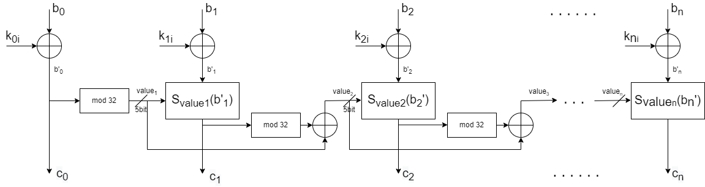

# Controller substitution cipher

## Description

One of the options for constructing controller substitution cipher is to use a set of 
N lookup tables, half of which are forward lookup tables and the other are backward lookup
tables (each forward lookup table has a corresponding backward lookup table).

It should be noted,that such a division is rather arbitrary (which of the tables is 
considered a forward substitution table, and which is a reverse substitution). 
It is only important that each forward lookup table has a (single) table that is 
mutually opposite to it. 

## Realisation

This program is a Go module that provides message encryption and decryption procedure.
For better visualization, image is taken as a message, but any other sequence of bytes
can be used.

To build the source, execute 

`go build -o bin/controlled-substitution-cipher main.go utils.go`

The program also has a set of standard tests written on matlab: 
- Histogram test
- Autocorrelation test
- Lattice test (scatter plot)

## Theory. Example of how it works

Let's consider a constructing a cipher with controlled substitutions. Suppose that 
there are N = 32 lookup tables (16 + 16) in total. Let us also assume that the forward 
substitution table T0 corresponds to the backward substitution table
T16, the forward substitution table T1 corresponds to the 
backward substitution table T17, etc. 

### Encryption procedure

Using the block cipher mode. For definiteness, assume the size of the encrypted 
block B is 64 bits. We divide each block B into 8 subblocks (8 bytes): b0, 
b1, ..., b7. Each i-th round of encryption uses its own 
"set" of 8-bit round secret subkeys: k0i, k1i, ..., k7i.
In this case, the tables of forward (and backward) substitution contains numbers from 
the range from 0 to 255:

|        0        |       1       |       2        |  ...   |        255        |
|:---------------:|:-------------:|:--------------:|:------:|:-----------------:|
|  a0  | a1 | a2  |  ...   |  a255  |
  

In table above, the bottom line contains all possible numbers from the top row, 
but arranged in a different order. The order of the numbers in the bottom line 
determines the specific version of the substitution table, and, therefore, 
the specific version of the substitution operation performed by this table.
The substitution operation is reduced to the selection by the value of the number in 
the upper row (input of the substitution table is the value of the input block) 
of the number under this number in the lower row. It is taken as an output block.

The structure of the i-th round of encryption with controlled substitutions is shown 
in scheme below:

    

Input 8-bit subblocks b0, b1, ..., b7 are added mod 2 
with secret round subkeys k0i, k1i, ..., k7i. 
Functional [mod 32] blocks extract five least significant bits from 8-bit 
calculated binary numbers. Allocated bits are used for unpredictable selection 
of substitution tables (this number == subs table number).

### Decryption procedure

To decrypt, it is necessary to correctly calculate the numbers of the reverse 
substitution tables, match the forward lookup tables used for encryption before. 
In the example, the substitution table Tk corresponds to the inverse 
substitution table with the number `k - 16 (mod 32)`, where k = 0, 1, ..., 31.

The structure of the i-th round of decryption with controlled substitutions is similar
to encryption but in reverse order.

### Important

Due to the fact that the encryption (decryption) procedure satisfies the scattering 
property, but does not satisfy the mixing property, patterns of the original image 
(contours, highlights, outlines) can be seen on the encrypted image. 
This negative to information hiding effect will manifest itself the more, the smaller 
cipher block size will be taken and vice versa. 

The problem can be solved, for example, by using encryption [modes other than 
Electronic Codebook (ECB)](https://en.wikipedia.org/wiki/Block_cipher_mode_of_operation). 
Increasing encryption rounds won't solve it.
